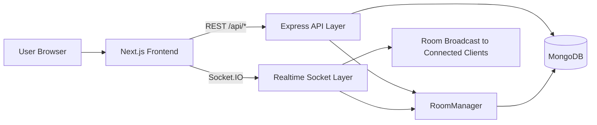
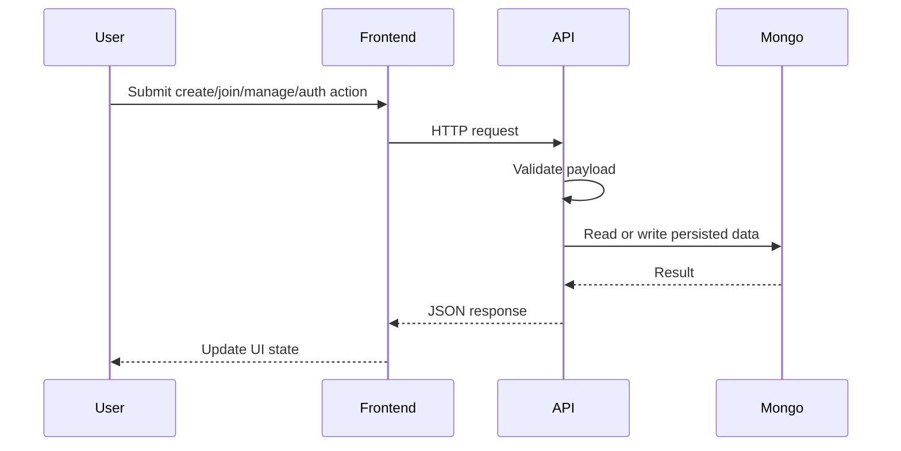
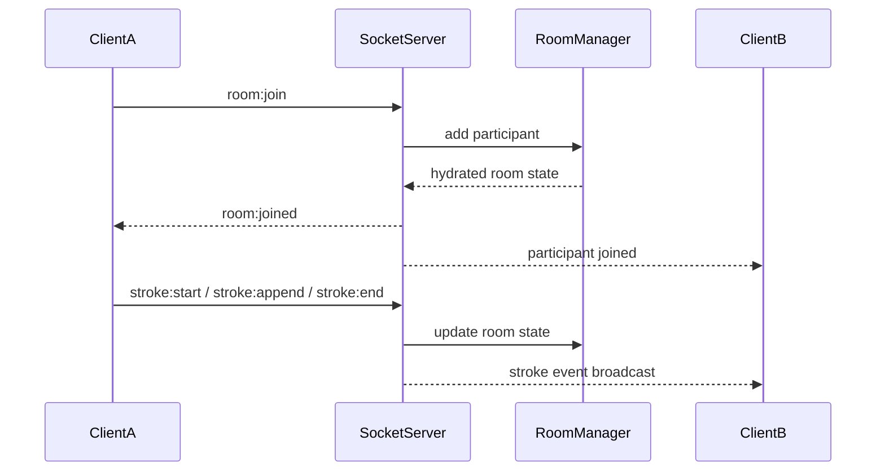
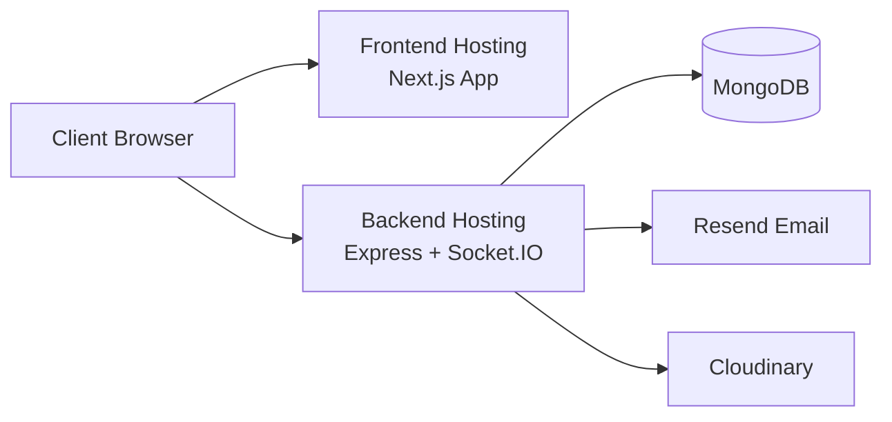

# Froddle / ArtColab Technical Report

> A room-based real-time collaborative whiteboard for lightweight sketching, discussion, and shared visual ideation.

**Project identity:** Froddle is the user-facing product brand, while ArtColab reflects the repository and deployment identity used in the codebase.  
**Authorship:** _Add student / team names here_  
**Primary stack:** Next.js, React, TypeScript, Express, Socket.IO, MongoDB, Mongoose, Tailwind CSS.

---

## 1. Executive Summary

Froddle / ArtColab is a browser-based collaborative whiteboard application designed for low-friction shared drawing. It allows users to create rooms, join existing sessions, draw in real time, chat, send quick reactions, and manage their rooms without installing software or navigating a heavy onboarding flow.

The project addresses a practical problem: most collaborative whiteboard systems are either too complex for quick sessions or too limited for meaningful multi-user interaction. Froddle aims to provide a simpler alternative that still supports room-based access control, guest participation, private rooms with passwords, responsive board interaction, and live synchronization across connected users.

From an engineering perspective, the project combines:

- a responsive Next.js frontend,
- a REST API for room and account workflows,
- a Socket.IO layer for real-time collaboration,
- MongoDB-backed persistence for users and rooms,
- and a shared TypeScript package for socket and canvas contracts.

---

## 2. Problem Statement

Modern collaboration often requires people to explain ideas visually in real time. Static drawing tools and single-user whiteboards are insufficient when multiple participants need to sketch, annotate, react, and discuss together inside a shared space.

The core problems this project solves are:

- the lack of a lightweight, browser-based collaborative whiteboard for instant use,
- the friction of account-only onboarding for casual participants,
- the need for room-level access control for public and private collaboration,
- the need for synchronized live drawing among multiple users,
- and the challenge of making such a workspace usable across mobile and desktop form factors.

---

## 3. Objectives

The main objectives of Froddle / ArtColab are:

1. Enable real-time shared drawing in a room-scoped workspace.
2. Support public and private room collaboration.
3. Allow both guest and registered-user access paths.
4. Synchronize drawing, chat, reactions, and participant presence live.
5. Provide an intuitive, responsive interface across mobile, tablet, and desktop devices.
6. Keep room access and collaboration flows simple enough for fast ad hoc use.
7. Provide room management and account/profile maintenance for authenticated users.

---

## 4. System Overview

At a high level, the system is split into five major layers:

- **Frontend:** Next.js App Router application that renders room pages, browse/manage views, auth flows, and profile management.
- **Backend API:** Express routes for authentication, room CRUD-style operations, profile updates, and room metadata retrieval.
- **Realtime layer:** Socket.IO server and client used for room joins, drawing events, participant presence, chat, and reactions.
- **Persistence layer:** MongoDB with Mongoose models for users and persisted room state.
- **Shared contracts:** A shared package containing socket event names and canvas/room types to reduce drift between frontend and backend.

### User journey summary

A typical user journey is:

1. Open the home page.
2. Continue as guest or authenticate as a registered user.
3. Create a room or join an existing room.
4. Enter the room workspace.
5. Connect to the Socket.IO room.
6. Receive the current room state.
7. Draw, chat, react, and collaborate live.
8. Optionally manage rooms or update account/profile settings later.

---

## 5. Detailed Feature List

Only features confirmed in the codebase are listed below.

### 5.1 Room features

- Create room.
- Join room by room code or room name.
- Browse active rooms.
- Manage owned rooms.
- Leave joined rooms.
- Delete owned rooms.
- Update room name.
- Update room visibility between public and private.
- Set or replace private-room password.
- Public/private room access control.

### 5.2 Whiteboard features

- Brush tool.
- Eraser tool.
- Fill tool.
- Shape tools: line, rectangle, square, circle, ellipse, triangle, and star.
- Undo and redo.
- Clear board.
- Export board as PNG.
- Copy board image.
- Reset zoom/view.
- Pinch-to-zoom / viewport zoom and pan behavior.
- Cursor presence indicators for collaborators.

### 5.3 Realtime collaboration features

- Live drawing synchronization.
- Live participant list updates.
- In-room chat.
- Emoji reactions.
- Room-scoped event broadcasting.
- Reconnection-aware client behavior.

### 5.4 Authentication and user features

- Guest login.
- User registration.
- User login by username or email.
- Session retrieval.
- OTP-based forgot-password flow.
- Profile update.
- Profile image upload.
- Account deletion.

### 5.5 UX and responsive features

- Desktop and mobile room workspace behavior.
- Orientation-aware room handling for touch devices.
- Password prompt flow for private rooms.
- Toasts, modals, and inline status banners.

### Features intentionally **not** claimed

The current report does **not** claim the following as shipped user features:

- stickers as a surfaced user-facing feature,
- room ownership transfer as a user-facing room-management feature.

These were removed because they are not part of the actual delivered product behavior expected by users.

---

## 6. Tech Stack

### Frontend

- **Next.js 14 App Router** for routing and application structure.
- **React 18** for interactive UI.
- **TypeScript** for static typing.
- **Tailwind CSS** for utility-first styling.
- **Lucide React** for iconography.
- **Zod** for client-side response validation.
- **Socket.IO Client** for realtime communication.

### Backend

- **Node.js** runtime.
- **Express** for REST endpoints.
- **TypeScript** for route and service typing.
- **Socket.IO** for realtime room communication.

### Database / storage

- **MongoDB** for user and room persistence.
- **Mongoose** for schema modeling and data access.
- **Cloudinary** for profile image storage.

### Realtime

- **Socket.IO rooms** for room-scoped event broadcasting.
- Shared socket event constants from the `shared` workspace package.

### Utilities / tooling

- **bcryptjs** for password hashing.
- **jsonwebtoken** for JWT-based auth.
- **Resend** for OTP email delivery.
- **nanoid** for short IDs.
- **ESLint**, **Prettier**, and TypeScript compiler checks.

### Deployment shape

The codebase is designed for a split frontend/backend deployment model:

- Next.js frontend deployment,
- long-running Node/Socket.IO backend deployment,
- external MongoDB database,
- and third-party services for email and image storage.

The environment configuration includes built-in client origin defaults for localhost plus deployed frontend hosts, which indicates intended hosted operation in addition to local development.

---

## 7. Architecture

### 7.1 High-level architecture

### 7.2 Request and data flow

### 7.3 Realtime synchronization flow

### 7.4 Room management update flow

```mermaid
flowchart LR
    M[Manage Rooms Page] --> E[Select Edit]
    E --> F[Populate edit form with selected room]
    F --> S[Submit updated name / visibility / password]
    S --> A[PATCH room settings API]
    A --> V[Validate owner and payload]
    V --> U[Update in-memory metadata and MongoDB]
    U --> R[Reload room lists]
    R --> UI[Show refreshed room state and success feedback]
```

### 7.5 Deployment diagram

---

## 8. Data Flow / Pipeline

### 8.1 Room creation flow

1. User submits room name, visibility, and optional password.
2. Frontend calls `POST /api/rooms/create`.
3. Backend validates the payload with Zod.
4. Backend checks for duplicate room names.
5. If private, backend hashes the password with bcrypt.
6. `RoomManager` creates the live room.
7. If MongoDB is available, the room is also persisted.
8. Frontend stores a room-entry hint and navigates to the room page.

### 8.2 Room join flow

1. User enters room code or room name.
2. Frontend calls `POST /api/rooms/join`.
3. Backend resolves the room from persisted or in-memory metadata.
4. Backend checks visibility and password rules.
5. Frontend navigates to `/room/[roomId]`.
6. Client emits `room:join` over Socket.IO.
7. Server adds the participant and returns room hydration.

### 8.3 Board load flow

1. Room page fetches room metadata via REST.
2. Room page opens the socket connection.
3. Client joins the socket room.
4. Server responds with room state.
5. Board component initializes canvas resolution and renders existing strokes.

### 8.4 Drawing event flow

1. Pointer or touch interaction occurs on the canvas.
2. Frontend converts screen coordinates to logical board coordinates.
3. Local draft stroke is rendered for immediate feedback.
4. Frontend emits `stroke:start`, then batched `stroke:append`, then `stroke:end`.
5. Server validates and stores the stroke in `RoomManager`.
6. Server broadcasts the stroke event to other room participants.
7. Other clients incrementally render the updates.
8. RoomManager schedules persistence of updated canvas state.

### 8.5 Board synchronization and persistence flow

1. Live room state is updated in memory first.
2. Persistence is debounced to reduce database write frequency.
3. MongoDB stores room canvas state, timestamps, and version increments.
4. Rehydrated rooms are loaded into memory on server startup.

### 8.6 Manage-room update flow

1. User opens the Manage Rooms page.
2. Frontend fetches owned and joined rooms.
3. User clicks **Edit** on an owned room.
4. Frontend stores the selected room in edit state and populates the form.
5. User updates name, visibility, and optional password.
6. Frontend submits `PATCH /api/rooms/:roomId/settings`.
7. Backend verifies ownership, validates payload, checks duplicate names, hashes password when needed, and updates in-memory metadata plus MongoDB.
8. Frontend reloads room lists and shows success feedback.

---

## 9. Core Modules / Components

### 9.1 Frontend application pages

- **`client/app/page.tsx`**: home page, create/join room flows, guest entry path.
- **`client/app/room/[roomId]/page.tsx`**: main collaboration workspace and room shell.
- **`client/app/browse-rooms/page.tsx`**: room discovery and join flow.
- **`client/app/manage-rooms/page.tsx`**: room management for owned/joined rooms.
- **`client/app/profile/page.tsx`**: profile editing and account deletion.
- **`client/app/auth/page.tsx`**: login, registration, and reset-password UI.

### 9.2 Whiteboard and workspace components

- **`client/components/canvas-board.tsx`**: board rendering, pointer handling, zoom/pan, drawing emission, cursor display.
- **`client/components/color-wheel-picker.tsx`**: extended color selection.
- **`client/components/confirm-modal.tsx`**: confirmation flows for destructive actions.
- **`client/components/toast.tsx`**: short-lived toast notifications.
- **`client/components/room-password-modal.tsx`**: private-room access prompt.
- **`client/components/site-header.tsx`** and UI atoms provide shared shell patterns.

### 9.3 Hooks and client libraries

- **`client/hooks/use-room-socket.ts`**: socket join lifecycle, room hydration, stroke/chat/reaction handling, reconnect logic.
- **`client/lib/api.ts`**: typed REST request helpers.
- **`client/lib/room-access.ts`**: local private-room access grant tracking.
- **`client/lib/room-entry.ts`**: room hint persistence between pages.
- **`client/lib/room-orientation.ts`**: touch-device room orientation/session behavior.
- **`client/lib/socket.ts`**: singleton socket client.

### 9.4 Backend modules

- **`server/src/index.ts`**: Express app setup, Socket.IO setup, room hydration on startup.
- **`server/src/routes/rooms.ts`**: room create, join, browse, manage, update, delete, leave, and room fetch endpoints.
- **`server/src/routes/auth.ts`**: guest auth, register, login, session, and forgot-password flow.
- **`server/src/routes/profile.ts`**: profile update and account deletion.
- **`server/src/socket/registerHandlers.ts`**: socket event registration and broadcasting.
- **`server/src/rooms/roomManager.ts`**: in-memory room state and persistence scheduling.
- **`server/src/models/User.ts`** and **`server/src/models/Room.ts`**: MongoDB models.

### 9.5 Shared package

- **`shared/types/socket.ts`**: socket event names and payload types.
- **`shared/types/canvas.ts`** and **`shared/types/room.ts`**: collaboration domain models.

---

## 10. Database / Data Model

### 10.1 User entity

The `User` model supports:

- email,
- username,
- hashed password,
- profile image,
- created rooms list,
- joined rooms list,
- reset-code / reset-session fields for OTP-based password reset,
- and timestamps.

### 10.2 Room entity

The `Room` model stores:

- room ID,
- room name,
- visibility,
- password hash,
- owner type (`user` or `guest`),
- owner ID,
- owner display name,
- activity timestamps,
- persisted canvas state,
- preview image placeholder field,
- and Mongo timestamps.

### 10.3 Canvas state

Persisted room canvas state includes:

- `strokes`,
- `lastSavedAt`,
- and a `version` counter.

The live collaboration state also holds participants, chat messages, redo stacks, and transient cursor information in memory through `RoomManager`.

### 10.4 In-memory room state

The `RoomManager` maintains:

- active participants,
- live strokes,
- chat history,
- redo stacks,
- room mode,
- room expiration metadata,
- and debounced persistence timers.

This enables fast room interactions without waiting for database round-trips on every stroke append.

---

## 11. API Documentation

### 11.1 Authentication APIs

- `POST /api/auth/guest` — create guest session.
- `POST /api/auth/register` — register a user account.
- `POST /api/auth/login` — log in by email or username.
- `GET /api/auth/me` — fetch current session.
- `POST /api/auth/logout` — end session client-side flow.
- `POST /api/auth/forgot-password/request` — request OTP.
- `POST /api/auth/forgot-password/verify-otp` — verify OTP.
- `POST /api/auth/forgot-password/reset-password` — set new password.

### 11.2 Room APIs

- `POST /api/rooms/create` — create a room.
- `POST /api/rooms/join` — validate room join.
- `GET /api/rooms/browse?q=...` — search active rooms.
- `GET /api/rooms/manage` — fetch owned/joined rooms.
- `PATCH /api/rooms/:roomId/settings` — update owned room settings.
- `DELETE /api/rooms/:roomId` — delete owned room.
- `POST /api/rooms/:roomId/leave` — leave joined room.
- `GET /api/rooms/:roomId` — get room metadata for room page entry.

### 11.3 Profile APIs

- `GET /api/profile` — fetch current user profile.
- `PATCH /api/profile` — update username, email, or profile image.
- `DELETE /api/profile/account` — delete authenticated user account.

### 11.4 API validation approach

The backend validates request payloads using Zod. This helps ensure:

- room names follow allowed format and length rules,
- passwords meet required constraints,
- room IDs use the expected 6-character pattern,
- and realtime payloads stay within expected shapes.

---

## 12. Socket / Realtime Event Design

### 12.1 Connection model

The frontend keeps a singleton Socket.IO client. When a room page is ready, the client connects and emits a room join payload containing:

- room ID,
- local user ID,
- display name,
- and optional avatar URL.

### 12.2 Room-scoped events

The server uses Socket.IO rooms to isolate collaboration traffic. Users only receive events for the room they joined.

### 12.3 Main realtime events

#### Room events

- `room:join`
- `room:leave`
- `room:joined`
- `room:state`
- `room:participant:joined`
- `room:participant:left`
- `room:participants:updated`
- `room:expired`
- `room:error`

#### Drawing events

- `stroke:start`
- `stroke:append`
- `stroke:end`
- `stroke:event`
- `stroke:undo`
- `stroke:undone`
- `stroke:redo`
- `stroke:redone`
- `board:clear`
- `board:cleared`

#### Presence and collaboration events

- `cursor:update`
- `cursor:presence`
- `chat:send`
- `chat:message`
- `reaction:send`
- `reaction:event`

### 12.4 Broadcast strategy

- The initiating client renders optimistically.
- The server updates room state in memory.
- The server broadcasts relevant deltas to peers in the same room.
- Full room state can be requested again if out-of-order append events occur.

### 12.5 Reconnection behavior

The frontend explicitly tracks `connecting`, `connected`, `reconnecting`, and `disconnected` states. On reconnect, the client re-emits room join so the room state can be rehydrated.

### 12.6 Consistency considerations

This design favors responsiveness and practical consistency over strict CRDT-style conflict resolution. It works well for lightweight collaborative drawing, but it does not yet implement sophisticated merging or authoritative version history.

---

## 13. UI/UX Design Decisions

### 13.1 Why the board is central

The board is the primary task surface. All room UI is built around keeping drawing central, visible, and accessible so the user’s attention remains on collaboration rather than navigation chrome.

### 13.2 Why side rails are used

The room workspace uses left and right rails to:

- keep high-frequency actions visible,
- separate board utilities from tool selection,
- reduce toolbar sprawl,
- and preserve a focused center workspace.

### 13.3 Why mobile differs from desktop

Touch-first use has different constraints:

- smaller viewport,
- stronger need for orientation handling,
- and a higher cost for oversized fixed panels.

For that reason, the project uses touch-aware room orientation logic and compact tool behavior for smaller/coarse-pointer environments.

### 13.4 Why large screens prioritize full-board visibility

On desktop and laptop screens, the main goal is to show the entire board and both tool rails together as one balanced workspace. This supports faster orientation, cleaner composition, and reduced unnecessary scrolling.

### 13.5 Why manage rooms and profile pages use card-based structure

These are administrative flows rather than immersive collaboration flows. A card-based structure keeps them readable, low-risk, and consistent with the overall Froddle visual language.

---

## 14. Challenges Faced

The project surfaces several practical engineering challenges:

1. **Board layout responsiveness:** fitting a fixed-aspect drawing surface into highly variable viewports.
2. **Mobile orientation handling:** touch devices require different room-shell behavior from desktop.
3. **Realtime synchronization:** drawing events must feel immediate while remaining stable across peers.
4. **Canvas rendering efficiency:** repeated rerenders can become expensive if not batched or incrementally drawn.
5. **Reconnect safety:** users should recover from temporary network loss without manual refresh.
6. **Room metadata consistency:** room state exists both in live memory and persisted storage.
7. **Private room access:** password handling must be simple for users but secure in storage.
8. **Hosted environment limitations:** auth, profile, Mongo, email, and image features depend on external services and environment variables.
9. **Manage-room edit flow reliability:** selected-room state and update persistence must remain consistent with existing delete/leave/open flows.

---

## 15. Fixes and Improvements Made

### 15.1 Desktop workspace layout fix

The room workspace was improved so that large screens prioritize full board visibility and balanced side rails. The main changes were:

- constraining the room shell to the viewport height on large screens,
- reducing layout-driven overflow,
- balancing left and right rail spacing vertically,
- and fitting the board surface to the available room workspace while preserving its aspect ratio.

### 15.2 Manage Rooms edit flow fix

The Manage Rooms page was improved so that:

- the selected room reliably enters edit state,
- the edit form populates correctly,
- visibility and password logic behave correctly,
- save/cancel feedback is clear,
- and the list refreshes cleanly after updates.

### 15.3 Report hardening

The report itself was rewritten to remove inaccurate claims and document only implemented or code-supported project behavior.

---

## 16. Limitations

The current implementation has honest technical limitations:

1. Performance may degrade as stroke counts grow very large.
2. In-memory room management is fast, but horizontal scaling would require a stronger distributed-state strategy.
3. The project does not yet implement version-history snapshots or full collaborative conflict-resolution semantics.
4. Browser differences can affect canvas behavior, pointer events, and fullscreen/orientation support.
5. Realtime collaboration is room-scoped and practical, but not yet optimized for very large concurrent sessions.
6. Authentication- and profile-related features depend on MongoDB availability.
7. Password reset depends on email service configuration.
8. Profile image upload depends on Cloudinary configuration.

---

## 17. Future Enhancements

Realistic next steps include:

- board snapshots and version history,
- richer collaboration permissions and moderation controls,
- scalable distributed room state for larger concurrency,
- improved replay or event-log support,
- richer import/export formats,
- advanced cursor and selection tools,
- stronger analytics/observability around room health,
- and performance tuning for large boards or longer sessions.

---

## 18. Testing / Validation

The system should be validated across the following scenarios:

### Functional checks

- room creation for public and private rooms,
- room join with valid and invalid passwords,
- room browse flow,
- room management edit/update/delete/leave behavior,
- auth login/register/guest flows,
- profile update and account deletion flows.

### Realtime checks

- two or more users drawing in the same room,
- chat and reaction synchronization,
- participant join/leave updates,
- cursor presence rendering,
- reconnect and room rehydration behavior.

### Layout and responsiveness checks

- desktop board visibility without unnecessary scroll,
- balanced desktop side-rail alignment,
- mobile room entry and room orientation behavior,
- tablet and profile page regression checks.

### Data-integrity checks

- password hashing for private-room updates,
- room metadata refresh after save,
- persistence of updated room settings,
- room cleanup after account deletion.

---

## 19. Deployment Notes

### 19.1 Frontend

The frontend is a Next.js application that can be hosted on a platform optimized for React SSR/SPA delivery.

### 19.2 Backend

The backend requires a long-running process because it handles:

- REST APIs,
- Socket.IO connections,
- room hydration,
- and scheduled cleanup of expired rooms.

### 19.3 Infrastructure dependencies

Production deployment requires:

- MongoDB connection string,
- JWT secret,
- allowed client origin configuration,
- Resend API credentials for OTP delivery,
- and Cloudinary credentials for profile-image upload.

### 19.4 Operational note

If MongoDB is unavailable, database-backed features degrade. The codebase explicitly logs this condition and warns that auth/profile functionality becomes unavailable.

---

## 20. Conclusion

Froddle / ArtColab is a full-stack collaborative whiteboard system built around room-based realtime interaction. It combines a responsive client, a practical backend API, Socket.IO-based live synchronization, and persistent storage for users and rooms. The result is a lightweight but technically meaningful project that demonstrates frontend engineering, backend API design, realtime systems, state synchronization, responsive UX, and production-oriented integration concerns in one cohesive application.

---

## 21. Top Interview Questions and Answers

### 1. Why did you choose Socket.IO instead of raw WebSockets?

Socket.IO provides room abstractions, reconnect handling, and a simpler event-based API, which reduced implementation complexity for a room-based collaboration product.

### 2. How does realtime board synchronization work?

The client emits stroke lifecycle events, the server updates room state in memory, and peers receive broadcast updates scoped to the same room.

### 3. Why is room state stored in memory first?

Drawing needs low latency. In-memory updates keep the board responsive while persistence happens asynchronously.

### 4. Why do you still persist room data to MongoDB?

Persistence allows room recovery, room hydration after restart, and durable user/room metadata.

### 5. How do you handle multiple users drawing at once?

Each client emits its own stroke stream, and the server stores and relays events in a room-scoped way so all participants can render the combined result.

### 6. How do you prevent invalid room updates?

The backend validates all room-setting payloads with Zod and checks room ownership before allowing updates.

### 7. How are private rooms secured?

Private-room passwords are hashed with bcrypt and validated on join.

### 8. Can guests use the app?

Yes. Guests can enter quickly, create/join rooms, and later upgrade to a user account.

### 9. What is guest-to-user migration?

It is the backend logic that preserves a guest’s room relationships when they register or log in to a permanent account.

### 10. Why use a shared TypeScript package?

It keeps socket event names and collaboration types consistent across frontend and backend.

### 11. How does undo/redo work?

Undo/redo is user-scoped in the room state, with redo stacks stored in memory by the room manager.

### 12. How is the board rendered efficiently?

The canvas component uses a committed backing canvas, incremental updates where possible, and batched append handling.

### 13. Why use a logical board size?

A logical coordinate space makes cross-device rendering more consistent while allowing responsive scaling in the viewport.

### 14. How is zoom and pan implemented?

The board tracks viewport scale and offsets, then maps pointer coordinates back into logical board coordinates.

### 15. Why is desktop layout treated differently from mobile?

Desktop has room for a balanced full workspace, while touch devices need compact controls and orientation-aware handling.

### 16. What was the desktop board-visibility issue?

The room shell and board sizing were allowing layout overflow on larger screens, which could force scrolling instead of fitting the full board into the viewport.

### 17. How did you fix the desktop workspace issue?

By constraining the large-screen workspace to viewport height, fitting the board within the available shell, and balancing side-rail spacing.

### 18. What was broken in Manage Rooms?

The edit workflow was not providing a clear, reliable selected-room editing experience with strong feedback and refresh behavior.

### 19. How did you fix the Manage Rooms edit flow?

I made the edit state explicit, ensured the form is populated from the selected room, improved save/cancel behavior, and refreshed room data after save.

### 20. Why do you use REST and sockets together?

REST is better for request/response workflows like auth and room management, while sockets are better for low-latency collaboration events.

### 21. How is room access controlled?

Room access starts with REST validation for room metadata and private-room password rules, then moves into socket-based room participation.

### 22. What happens if a user disconnects?

Socket.IO reconnection logic attempts recovery, and the client can rejoin the room and rehydrate state.

### 23. How do you track participant presence?

The server stores room participants and broadcasts participant updates and cursor presence to connected users.

### 24. How do you handle room cleanup?

The backend runs periodic cleanup for expired/idle rooms using a timed interval and room manager cleanup logic.

### 25. Why use MongoDB here?

The room and user documents fit naturally in a document model, especially with nested canvas state.

### 26. What are the tradeoffs of MongoDB for this project?

It is flexible for nested state, but very large arrays and strict concurrency control need careful future scaling decisions.

### 27. Why validate responses on the client too?

Client-side validation protects the UI from malformed backend responses and makes failures easier to diagnose.

### 28. How is authentication implemented?

Users authenticate with JWTs, while guests receive guest tokens. Tokens are attached to API requests through the client helper layer.

### 29. How does forgot-password work?

The server generates a short-lived OTP, stores only hashed reset data, and verifies it before issuing a temporary reset session token.

### 30. How do profile images work?

The frontend sends a data URI to the backend, which uploads it to Cloudinary and stores the resulting URL in the user profile.

### 31. How do you avoid breaking mobile while improving desktop?

By scoping layout changes to the room workspace and using breakpoint- and pointer-aware behavior instead of global layout rewrites.

### 32. How is chat implemented?

Chat uses socket events to send and broadcast room-scoped messages, while the room manager stores a bounded in-memory chat history.

### 33. How do reactions work?

They are lightweight socket broadcasts that let all clients render short-lived visual feedback in the room.

### 34. What are the biggest scaling risks?

High stroke volume, many concurrent participants, and single-instance in-memory room coordination are the main future scaling limits.

### 35. How would you scale this system further?

I would introduce shared/distributed room state, stronger event persistence, horizontal socket coordination, and more deliberate canvas-state compaction.

### 36. Why not use CRDTs here?

The current product scope focuses on practical collaborative drawing rather than complex object-level concurrent editing, so a simpler event-stream model is sufficient.

### 37. What makes this project interview-worthy?

It demonstrates full-stack engineering, realtime systems, responsive UI/UX, API design, persistence, external-service integration, and production-oriented tradeoffs.

### 38. What is one limitation you would mention honestly in a viva or interview?

The current architecture is excellent for lightweight collaboration but would need additional distributed-state design to support significantly larger concurrency.
